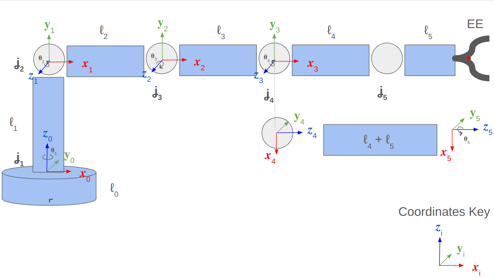
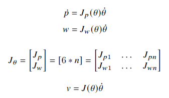

# MP1 - 5DOF Robot Kinematics and Control

## Overview
This project focused on:
- Applying the **Denavit-Hartenberg (DH) convention** to determine forward kinematics equations.
- Deriving and implementing **Jacobian matrices** for robot manipulators, enabling resolved-rate motion control.

Diagram of the 5-DOF robot arm with the coordinate frames

## Forward Kinematics

### DH Parameters
The DH parameters for this robot were derived assuming the home position and coordinate frames as shown in the figure above. These parameters define the location of a link-frame of the robot relative to the previous link-frame.

## Inverse Jacobian & Motion Control
We then initialize a Jacobian matrix and iteratively compute its elements by extracting each joint’s position and rotation axis from the transformation matrices. The linear velocity Jacobian is determined using the cross-product of the joint’s rotation axis and the position difference between the EE and the joint. The pseudo-inverse of the Jacobian matrix is then used to compute the required joint velocities, ensuring numerical stability even in singular configurations. Finally, joint angles are updated iteratively using these computed velocities over small time steps, enabling smooth motion tracking of the desired end-effector velocity.

## Visualization and Hardware Control

Visualizer: https://www.youtube.com/watch?v=0h8nh2I-8vQ

Physical Robot: 
- Part 1: [Video Link](https://drive.google.com/file/d/1TvL4BzMpvhX_pkL2bfbgio_u2IYsQSbX/view?usp=drive_link)
- Part 2: [Video Link](https://drive.google.com/file/d/1BrRJkHzDXgy8Xag4MnWLZKQ6sB9ykE6d/view?usp=sharing)
